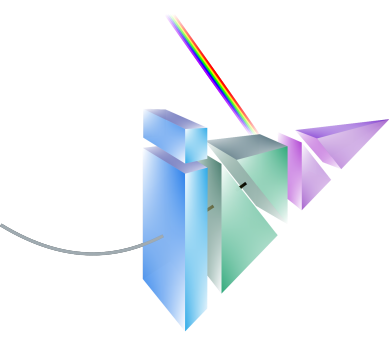
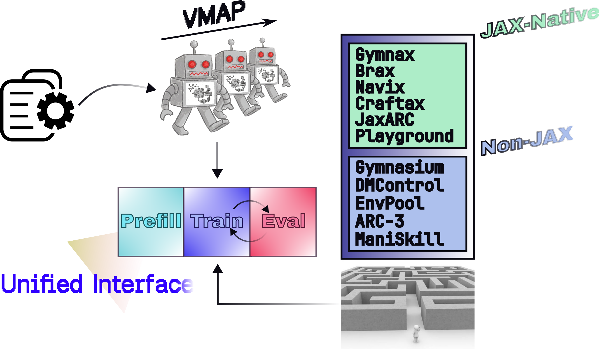
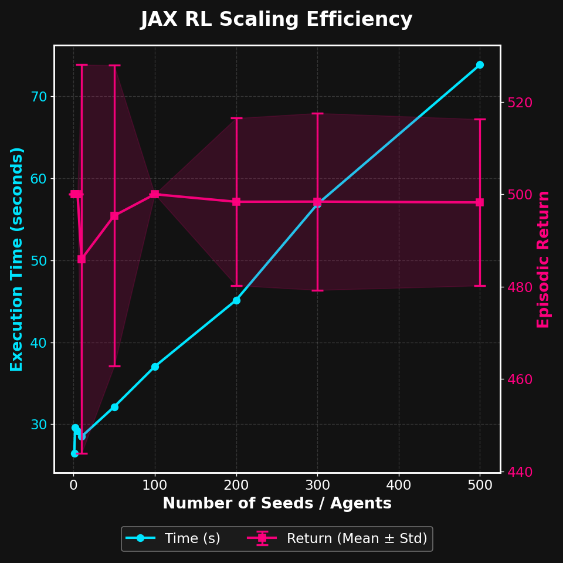
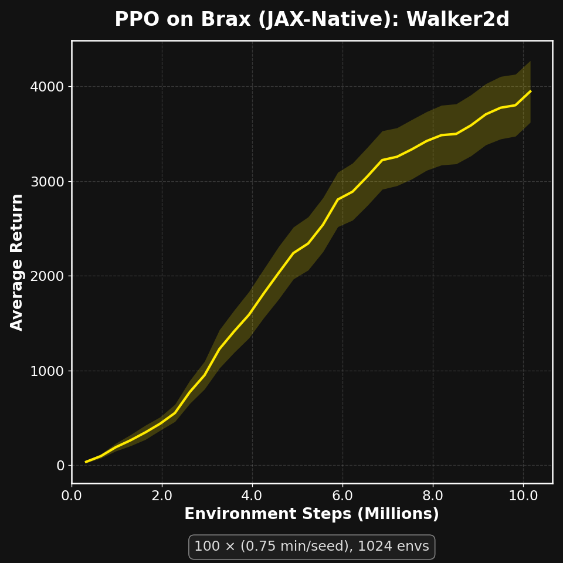
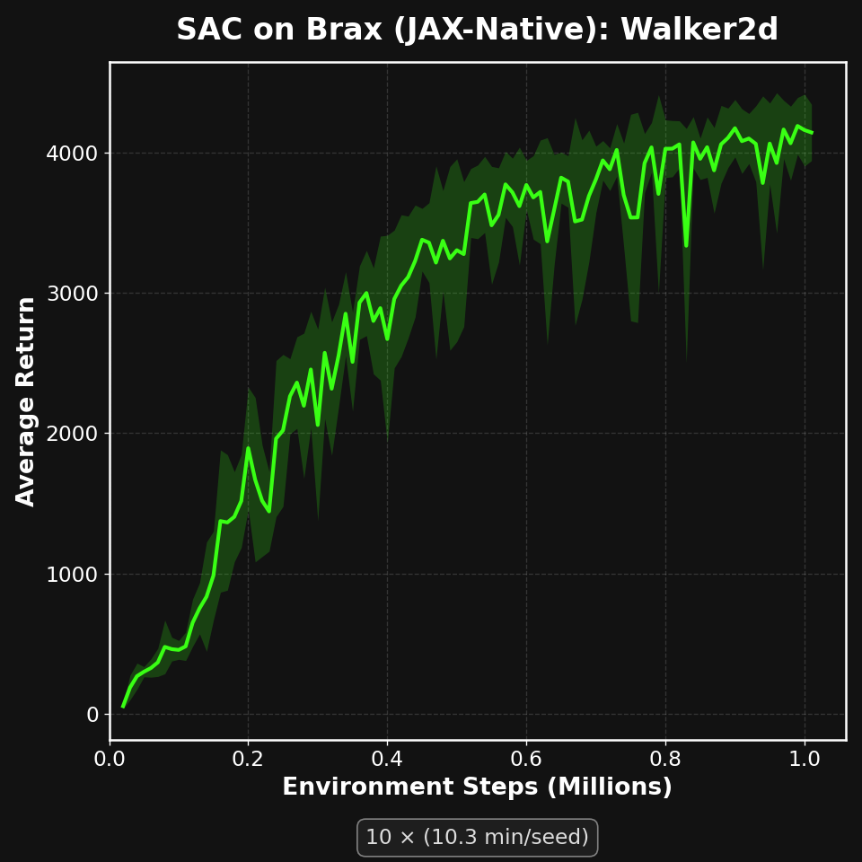
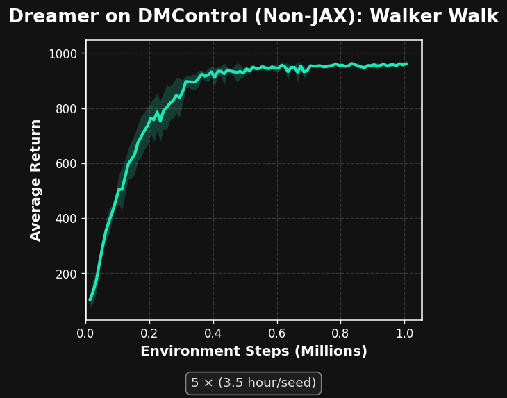

<div align="center">
</img>
</div>

# Jaxinn: A Modular, Vectorized, and Extensible JAX Reinforcement Learning Framework

Jaxinn is a high-performance, pure JAX Reinforcement Learning (RL) framework with a clean, intuitive, object-oriented API. It empowers researchers to train massively parallel agents in seconds on GPUs, unlocking significantly higher throughput for both model-based and model-free RL. Jaxinn provides a unified interface for a diverse suite of environments—all of which are fully JIT-compatible, even if they aren't natively written in JAX. With its modular architecture, you can easily build custom agents by plugging together existing components, allowing you to focus on your algorithm rather than rewriting training boilerplate.

## Why Jaxinn?
<div align="center">
</img>
</div>

- 🛡️ Strongly-typed Configuration: A modular, object-oriented config system that routes components directly at the command line.
- ⚡ Vectorize Everywhere: Parallelize environments, episodes, and agents effortlessly by adjusting just a few simple parameters.
- 🔄 Unified Interface: A single, universal trainer loop runs all agents seamlessly within a self-sufficient environment ecosystem.
- 🌍 Diverse Environments: JAX-native? Good to go. `jit` or `vmap` breaks? No problem.
- 📊 Built-in Logger: Out-of-the-box multi-seed experiment tracking with TensorBoard.
- 🧩 Highly Modular: Grab a loss, a set of models, and a rule to build a custom agent.

## Get Started
### Installation
You can use Jaxinn by cloning the repository and use `uv` to manage dependency:

``` bash
git clone https://github.com/MagiFeeney/jaxinn.git
cd jaxinn
pip install uv
```

`uv` allows us to select the environment we want to use:

``` bash
uv pip install -e .[gymnax] # Install Gymnax

uv pip install -e .[envpool] # Install EnvPool

uv pip install -e .[all] # Install all environments
```

### Quickstart
Route everything through the command line and run it—that's it! You can decide which agent to run, vectorization at different levels, environment wrappers, algorithmic control flows, CPU/GPU memory, model architectures, and more. For example, you can run PPO on Brax using the script below.

``` bash
uv run jaxinn/main.py \
  --num_seeds 100 \
  --logger.log_dir "results/brax/walker2d/ppo" \
  \
  --env.env_id "brax/walker2d" \
  --env.wrapper.num_envs 1024 \
  --env.wrapper.normalize_reward \
  --env.wrapper.normalize_obs \
  --env.wrapper.action_repeat 1 \
  \
  --exploration.num_environment_steps 10158080 \
  --exploration.num_eval_episodes 128 \
  --exploration.eval_interval 327680 \
  --exploration.train_interval 32768 \
  --exploration.episode_length 32768 \
  --exploration.train_iterations 4 \
  --exploration.num_prefill_episodes 0 \
  --exploration.action_noise 0. \
  \
  agent:ppo-agent-config \
  --agent.optimization.entropy_coef 0.0 \
  --agent.optimization.normalize_adv \
  --agent.memory.type "batched" \
  --agent.memory.device "gpu" \
  \
  agent.actor-critic.model:actor-critic-shared-config \
  --agent.actor-critic.model.actor.activation-function "tanh" \
  --agent.actor-critic.model.actor.hidden-size 64 64 \
  --agent.actor-critic.model.critic.activation-function "tanh" \
  --agent.actor-critic.model.critic.hidden-size 64 64 \
  \
  agent.actor-critic.model.actor.continuous-head:free-std-normal-head-config
```

* Running SAC on Brax
``` bash
uv run jaxinn/main.py --num_seeds 10 --logger.log_dir "results/brax/walker2d/sac" --env.env_id "brax/walker2d" --env.wrapper.num_envs 1 --env.wrapper.action_repeat 1 --exploration.num_environment_steps 1000000 --exploration.num_eval_episodes 10 --exploration.eval_interval 10000 --exploration.train_interval 1 --exploration.episode_length 1 --exploration.train_iterations 1 --exploration.num_prefill_episodes 10000 --exploration.action_noise 0. --exploration.no-restart agent:sac-agent-config --agent.memory.type "uniform" --agent.memory.device "gpu" --agent.actor.optimizer.lr 3e-4 --agent.actor.model.actor.activation-function "relu" --agent.actor.model.actor.hidden-size 256 256 --agent.critic.optimizer.lr 3e-4 --agent.critic.model.critic.activation-function "relu" --agent.critic.model.critic.hidden-size 256 256 --agent.critic.model.critic.use_action --agent.optimization.target_update_interval 1 --agent.optimization.tau 0.005 agent.actor.model.actor.continuous-head:tanh-normal-head-config --agent.actor.model.actor.continuous-head.log-std-range -10 2  --agent.actor.model.actor.continuous-head.mean-scale None
```

* Running Dreamer on DMC
``` bash
uv run jaxinn/main.py --num_seeds 5 --logger.log_dir "results/dmc/walker_walk/dreamer" --env.env_id "dmc/walker_walk" --env.wrapper.num_envs 1 --env.creation from_pixels True render_height 64 render_width 64 vectorization_mode "async" --env.separated --exploration.num_environment_steps 1000000 --exploration.num_eval_episodes 10 --exploration.num_prefill_episodes 5 --exploration.action_noise 0.3 agent:dreamer-agent-config --agent.memory.capacity 1000000 --agent.memory.type "uniform" --agent.memory.device "cpu" --agent.optimization.kl_balance 0.0 --agent.optimization.batch_size 50 --agent.optimization.chunk_size 50 agent.actor.model.continuous_head:tanh-normal-head-config
```

> [!NOTE]
> For pixel-based tasks and algorithms that require long sequence processing, JAX can easily become memory-bound, hindering efficiency. Therefore, we recommend using the CPU memory option to sidestep this issue.

> [!TIP]
> The life cycle of an algorithm is characterized by the divisibility chain: `num_environment_steps` → `eval_interval` → `train_interval` → `episode_length` → `num_envs`. You can adjust them relative to each other to accommodate different algorithms, as we did above. Additionally, `train_iterations` determines the number of updates per `train_interval`. Depending on the context, this can also be interpreted as "epochs" or the "UTD ratio".

## Algorithms
### Model-based RL
- [Dreamer](https://arxiv.org/pdf/1912.01603)
- [DreamerV2](https://arxiv.org/pdf/2010.02193)

### Model-based RL
- [PPO](https://arxiv.org/pdf/1707.06347)
- [SAC](https://arxiv.org/pdf/1801.01290)

## Adapters
### JAX Native Environments
- [Brax](https://github.com/google/brax/tree/main)
- [Craftax](https://github.com/MichaelTMatthews/Craftax)
- [Gymnax](https://github.com/RobertTLange/gymnax)
- [MuJoCo Playground](https://github.com/google-deepmind/mujoco_playground/tree/main)
- [Navix](https://github.com/epignatelli/navix/tree/main)
- [JaxARC](https://github.com/aadimator/JaxARC)

### Non-JAX Environments
- [EnvPool](https://github.com/sail-sg/envpool/tree/main)
- [Gymnasium](https://github.com/farama-foundation/gymnasium)
- [DeepMind Control Suite](https://github.com/google-deepmind/dm_control)
- [ARC-AGI-3](https://arcprize.org/arc-agi/3)

## Examples
- Create a custom agent:
``` python
from typing import Any, ClassVar

import jax

from jaxinn.agent.rules import Agent, Learner
from jaxinn.agent.losses import CustomLossMixIn
from jaxinn.agent.models import ActorCritic
from jaxinn.agent.memory import Uniform as UniformMemory
from jaxinn.configs.agent import CustomAgentConfig

class CustomAgent(CustomLossMixIn, Agent):
    # Bind your agent to the config so that we can directly route it from cli.
    config_cls: ClassVar[type] = CustomAgentConfig

    actor_critic: Learner[ActorCritic]
    memory: UniformMemory

    # Define your update rule and all set!
    def learn(self, data: Any, key: jax.Array) -> tuple["Agent", dict[str, jax.Array]]:
        pass
```

- Use env as a standalone:
``` python
import jax

from jaxinn.envs.adapters.gymnax import Gymnax
from jaxinn.envs.wrapper import UnsqueezeScalar, Batched

env_name = ...
num_episodes = ...
episode_length = ...
num_envs = ...

env = Gymnax.create(env_name)
env = UnsqueezeScalar(env)
env = Batched(env, num_envs)

@jax.vmap
def rollout(key):
    key_reset, key_scan = jax.random.split(key, 2)
    transition, env_info, env_state = env.reset(key_reset)

    def make_episode_fn(carry, _):
        key, env_state = carry
        key, key_action, key_step = jax.random.split(key, 3)
        keys_action = jax.random.split(key_action, num_envs)
        action = jax.vmap(env.action_space.sample)(keys_action)
        transition, env_info, next_env_state = env.step(key_step, env_state, action)
        return (key, next_env_state), transition

    _, transitions = jax.lax.scan(
        make_episode_fn,
        (key_scan, env_state),
        None,
        length=episode_length // num_envs
    )
    return transitions

# Execute in parallel!
keys = jax.random.split(jax.random.PRNGKey(42), num_episodes)
transitions = rollout(keys)
```

## Benchmark
We evaluate several algorithms on standard benchmarks, illustrating the sublinear scaling efficiency of JAX and strong reproducibility.

<div align="center">
  <br>
  
</div>

## Code Structure
<details>
<summary>Show details</summary>

```
jaxinn/
├─ agent/
│  ├─ losses/
│  │  ├─ __init__.py
│  │  ├─ base.py
│  │  ├─ model_based.py
│  │  ├─ model_free.py
│  │  └─ utils.py
│  ├─ memory/
│  │  ├─ __init__.py
│  │  ├─ buffer.py
│  │  └─ storage.py
│  ├─ models/
│  │  ├─ perception/
│  │  │  ├─ __init__.py
│  │  │  ├─ action_encoder.py
│  │  │  ├─ base.py
│  │  │  ├─ cnn.py
│  │  │  └─ linear.py
│  │  ├─ world/
│  │  │  ├─ __init__.py
│  │  │  ├─ continuation.py
│  │  │  ├─ representation.py
│  │  │  ├─ reward.py
│  │  │  ├─ transition.py
│  │  │  └─ world.py
│  │  ├─ __init__.py
│  │  ├─ actor.py
│  │  ├─ critic.py
│  │  ├─ distributions.py
│  │  ├─ heads.py
│  │  └─ utils.py
│  ├─ rules/
│  │  ├─ model_based/
│  │  │  ├─ __init__.py
│  │  │  └─ dreamer.py
│  │  ├─ model_free/
│  │  │  ├─ __init__.py
│  │  │  ├─ actor_critic.py
│  │  │  ├─ ppo.py
│  │  │  └─ sac.py
│  │  ├─ __init__.py
│  │  ├─ base.py
│  │  ├─ learner.py
│  │  └─ utils.py
│  ├─ __init__.py
│  └─ registry.py
├─ common/
│  ├─ structs.py
│  └─ transforms.py
├─ configs/
│  ├─ agent/
│  │  ├─ __init__.py
│  │  ├─ actor_critic.py
│  │  ├─ base.py
│  │  ├─ dreamer.py
│  │  ├─ memory.py
│  │  ├─ ppo.py
│  │  └─ sac.py
│  ├─ __init__.py
│  ├─ base.py
│  ├─ config.py
│  ├─ custom.py
│  ├─ env.py
│  ├─ head.py
│  └─ model.py
├─ envs/
│  ├─ adapters/
│  │  ├─ __init__.py
│  │  ├─ arc.py
│  │  ├─ brax.py
│  │  ├─ craftax.py
│  │  ├─ dm_control.py
│  │  ├─ envpool.py
│  │  ├─ gymnasium.py
│  │  ├─ gymnax.py
│  │  ├─ jaxarc.py
│  │  ├─ maniskill.py
│  │  ├─ mujoco_playground.py
│  │  └─ navix.py
│  ├─ __init__.py
│  ├─ environment.py
│  ├─ factory.py
│  ├─ spaces.py
│  ├─ vmap.py
│  └─ wrapper.py
├─ __init__.py
├─ logger.py
├─ main.py
└─ trainer.py
```
</details>

## Contributing
Issues and PRs are welcome, but please be specific, considerate, and communicate your problem or goal clearly.

## Acknowledgement
Jaxinn is built on [equinox](https://github.com/patrick-kidger/equinox/tree/main) and inspired by [rejax](https://github.com/keraJLi/rejax/tree/main). We are incredibly grateful for the authors' dedication.

## License
Jaxinn is licensed under the [GNU General Public License v3.0 (GPLv3)](LICENSE) for greater accessibility.

## Citation
Should you find this work useful for your research, please consider citing:
``` bibtex
@software{jaxinn2026,
  title={{Jaxinn}: A Modular, Vectorized, and Extensible JAX Reinforcement Learning Framework},
  author={Jianfei Ma and Wee Sun Lee},
  url={https://github.com/MagiFeeney/jaxinn}
  year={2026},
}
```
